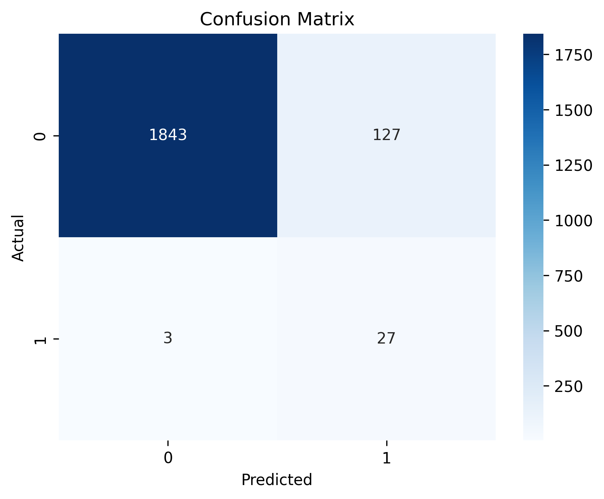
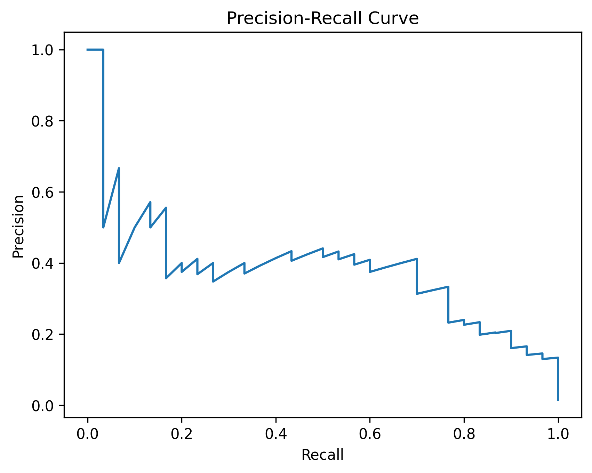
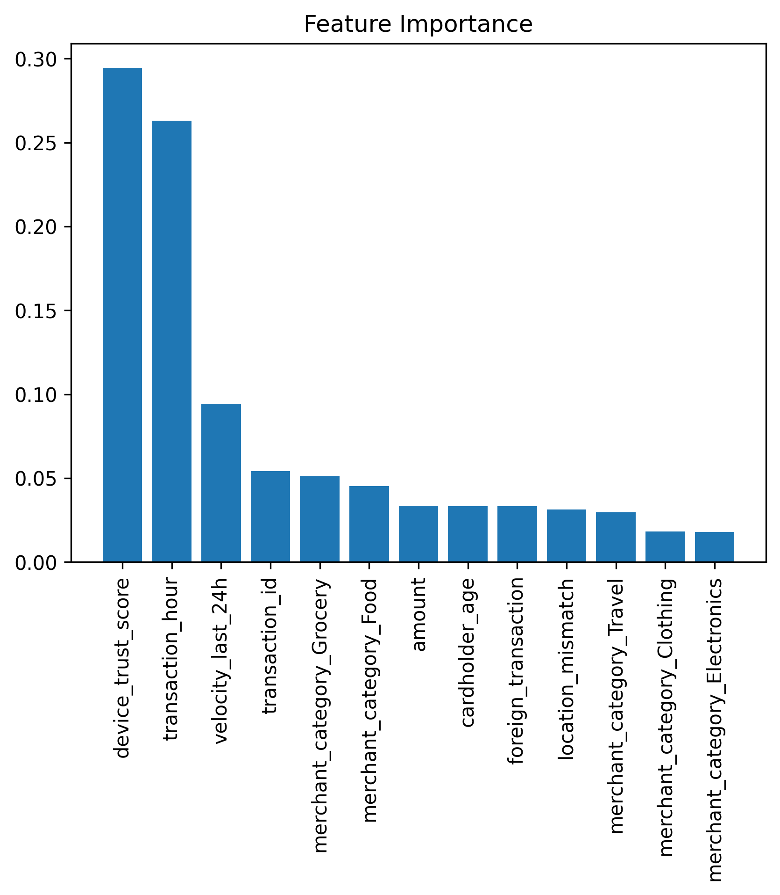

# Fraud Detection System (Machine Learning)

<p align="center">
  
</p>

<p align="center">
  
  
  
</p>

---

## About

This project explores how machine learning can be applied to detect fraudulent credit card transactions in a realistic setting.

The focus is not just on building a model, but on understanding how fraud behaves in highly imbalanced data and how evaluation choices affect real-world outcomes.

---

## The Problem

Fraudulent transactions are rare and often hidden within large volumes of legitimate activity.

Because of this, a model can achieve high accuracy by simply predicting “not fraud” for every case, making accuracy a poor measure of performance in this context.

---

## The Approach

To address this, the system was designed with the following considerations:

- SMOTE to handle class imbalance  
- Random Forest for robust classification  
- Threshold tuning to improve fraud detection sensitivity  
- Evaluation based on business impact rather than accuracy alone  

---

## Key Results

| Metric | Value |
|--------|------|
| Fraud Recall | 70% |
| Fraud Precision | 41% |
| ROC-AUC | 0.978 |
| Estimated Cost | $4,800 |

---

## Model Performance

### Confusion Matrix
<p align="center">
  
</p>

### Precision-Recall Curve
<p align="center">
  
</p>

### Feature Importance
<p align="center">
  
</p>

---

## How It Works

1. Data loading and inspection  
2. Feature encoding  
3. Train-test split  
4. SMOTE applied to balance classes  
5. Feature scaling  
6. Model training (Random Forest)  
7. Threshold optimization  
8. Evaluation using multiple metrics  

---

## Key Insights

- Device trust score is the strongest predictor of fraud  
- Transaction timing reveals meaningful patterns  
- High transaction frequency often signals elevated risk  
- Threshold tuning improves fraud detection performance significantly  

---

## Business Perspective

The model is intentionally optimized to prioritize fraud detection over strict accuracy.

In real-world systems, missing fraudulent transactions is more costly than investigating false positives. This trade-off guided how the model was tuned and evaluated.

---

## How to Run

```bash
pip install -r requirements.txt
python src/fraud_model.py
Project Structure

fraud-detection-project/
│
├── data/
├── src/
├── outputs/
├── README.md
├── requirements.txt

Future Improvements
Introduce gradient boosting models (XGBoost / LightGBM)
Build a real-time inference pipeline
Deploy with a lightweight dashboard
Expand feature engineering

Author

Olamide Quadri